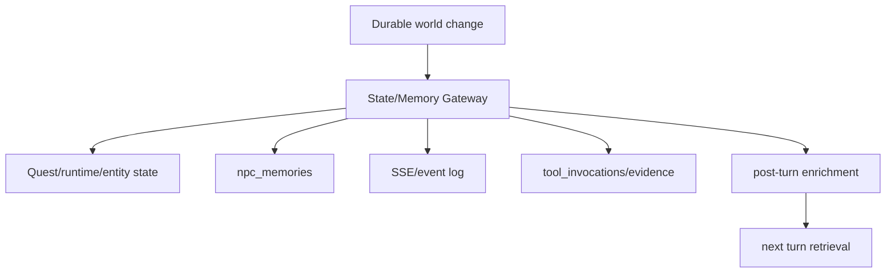
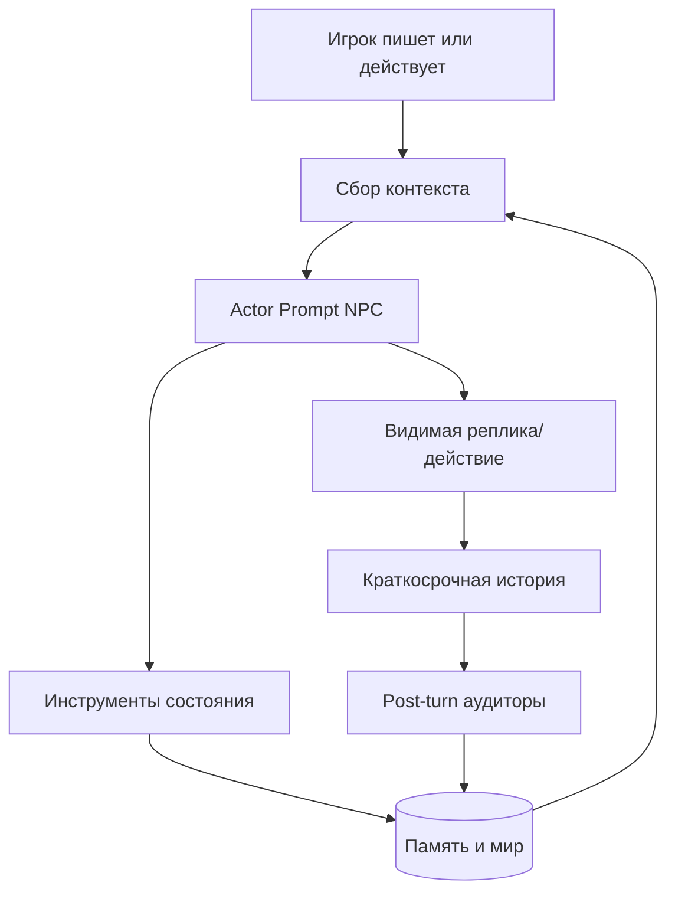
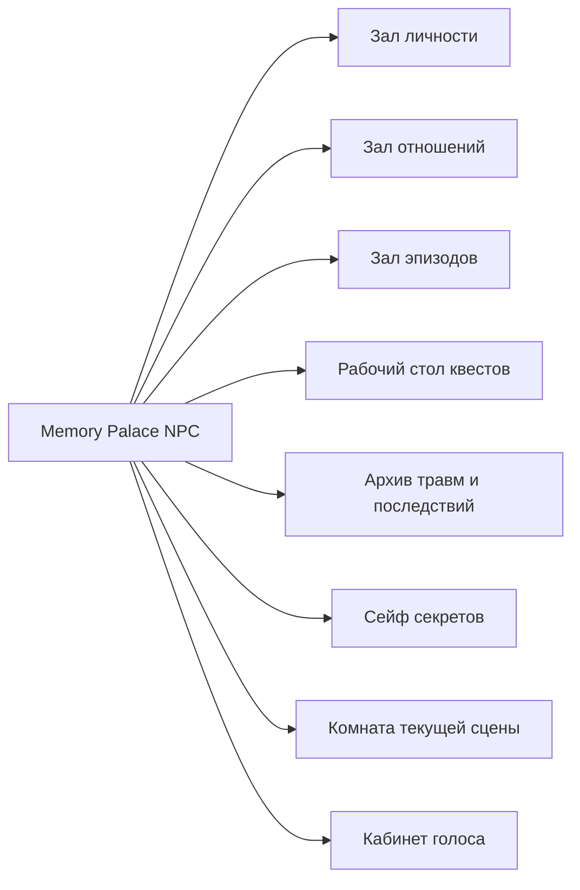

# AI NPC Memory Palace

## Как сделать из ИИ-агента живого NPC

Презентация описывает воспроизводимую архитектуру NPC-агента для чатовой
ролевой игры: память, характер, актерскую модель, режимы поведения, квестовую
работу, события, боевые и интимные сцены, runtime-состояния и контроль качества.

---

## Главная Идея

NPC не должен быть "ответчиком на реплики". Он должен быть игровым персонажем с:

- долговременной памятью;
- текущим эмоциональным состоянием;
- отношениями с игроком;
- собственными целями и страхами;
- голосом, телесностью, привычками и границами;
- механическим доступом к инструментам мира;
- обязанностью сохранять последствия в состояние игры.

Это и есть "дворец памяти NPC": не просто vector database, а структурированная
система комнат, где каждый тип опыта хранится и вызывается по назначению.

---

## Это Уже Дворец Памяти?

Архитектурно - да. Правильная форма именно такая: NPC имеет не одну "память",
а дворец из связанных комнат:

- личность и актерская роль;
- эпизодические memories;
- отношения и эмоциональные долги;
- активные квестовые обязательства;
- runtime-состояние сцены и тела;
- секреты и знания с ограниченной видимостью;
- последние реплики как краткосрочная память;
- post-turn аудиторы, которые чинят голос, память и continuity.

Но "доделанный" дворец памяти - это не только схема. Он считается готовым,
когда каждый значимый игровой beat проходит полный цикл:

```text
событие -> state write -> memory write -> voice enrichment -> retrieval -> новое поведение NPC
```

Если хотя бы один шаг обходится, NPC может "знать в тексте", но не знать в
состоянии. Это и есть главный класс досадных ошибок.

---

## Идеальная Работа Без Ошибки

Представим: NPC выдал квест, игрок нажал "Принять", потом спрашивает детали.

Идеальный pipeline:

```mermaid
sequenceDiagram
  participant UI as Игрок/UI
  participant Server as Runtime
  participant Quest as Quest State
  participant Mem as NPC Memory
  participant Actor as NPC Actor
  participant Voice as Voice/Anchor

  UI->>Server: accept quest
  Server->>Quest: status=active, giver_id=npc, stage=accepted
  Server->>Mem: NPC remembers player accepted the job
  Server->>Actor: next turn context includes active commitment
  Actor->>UI: explains destination, proof, risk, first step
  Voice->>Mem: rewrites memory in NPC voice
```

В таком мире NPC не может ответить "какой конверт?", если он сам только что
выдал конверт. Его prompt получает не догадку, а установленный факт:

```text
Active commitment:
- Quest accepted by player.
- This NPC is giver.
- Current stage: accepted.
- NPC must acknowledge the job and provide next step.
```

---

## Как Память Меняет Поведение

Память не должна быть архивом для красоты. Она должна давить на действие.

```text
Memory:
"I remember that the player accepted my sealed-letter job and asked for the
truth instead of just the coin."

Runtime:
quest_status=active
relationship_band=neutral
mood=measuring

Actor result:
NPC does not re-offer the quest.
NPC gives operational details.
NPC tests whether the player can keep quiet.
NPC may add a small warning because trust is not yet earned.
```

Идеальное поведение:

- NPC признает общий факт;
- говорит из своего характера;
- дает следующий шаг;
- не раскрывает секреты сверх своего доверия;
- записывает новую память, если игрок сказал или сделал что-то значимое.

---

## Где Была Досадная Ошибка

Типовая ошибка такого пайплайна: часть системы пишет факт не через единый
memory/state gateway.

Например:

```text
quest accepted -> quest state changed
but
NPC memory / giver commitment / prompt block was not refreshed correctly
```

Или:

```text
reward memory inserted directly into database
but
add_memory side effects were skipped:
- no salience seed
- no memory:added event
- no voice enrichment
- no tool-history proof
```

В результате игрок видит, что карточка квеста появилась, но NPC-актер в
следующем ходе не получает достаточно сильный контекст, чтобы вести себя как
человек, который сам этот квест выдал.

---

## Как Это Должно Быть Исправлено

Все durable facts должны идти через единый контракт записи:



Правило:

```text
Нельзя создавать игровой факт только текстом.
Нельзя создавать memory обходом основного write path.
Нельзя выдавать квест без prompt-visible commitment для giver NPC.
```

После такого исправления NPC будет получать в контексте не только "где он стоит",
но и "что он обязан помнить и продолжить".

---

## Критерий Готовности Дворца

Дворец памяти считается готовым, когда проходят эти проверки:

1. NPC помнит квест, который сам выдал.
2. NPC помнит важный бой и меняет отношение к победителю/побежденному.
3. NPC помнит интимную или доверительную сцену как эмоциональный факт, а не как
   одноразовый текст.
4. NPC использует прошлые долги, услуги и предательства в торге.
5. NPC различает личное знание, слух, публичный факт и секрет.
6. NPC не знает того, чего он не мог узнать.
7. Игрок может решить квест нестандартно, и это станет новой веткой памяти.
8. После save/load memory не теряется и не превращается в старую схему.
9. Post-turn аудиторы находят пропущенный memory threshold.
10. Retrieval подает в prompt только нужные memories, а не весь архив.

До этого момента это не "финальный дворец", а правильный фундамент дворца.

---

## NPC Как Система



NPC живет не в одном prompt'е. Prompt только управляет текущим ходом. Личность
живет в данных, памяти, runtime-state и post-turn проверках.

---

## Дворец Памяти



Каждая "комната" отвечает на отдельный вопрос:

- Кто я?
- Чего я хочу?
- Что я помню об игроке?
- Что между нами не закрыто?
- Какой квест я веду?
- Что я скрываю?
- Что я сейчас чувствую?
- Как я говорю именно сейчас?

---

## Базовые Слои Памяти

| Слой | Что хранит | Для чего нужен |
|---|---|---|
| Identity | биография, роль, голос, привычки | чтобы NPC был узнаваем |
| Episodic memory | события и факты прошлого | чтобы NPC не забывал |
| Relationship memory | доверие, вражда, долг, близость | чтобы отношения менялись |
| Quest memory | обязательства, выданные задания | чтобы NPC знал свои квесты |
| Runtime state | mood, stance, HP, занятость | чтобы поведение было живым |
| Transcript | последние реплики | чтобы сохранялся диалоговый поток |
| Secrets | знания с ограниченной видимостью | чтобы NPC не говорил лишнее |

---

## Минимальная Схема NPC

```yaml
npc:
  id: "npc_mara_blackwell"
  canonical_name: "Mara Blackwell"
  role: "innkeeper and information broker"
  public_face: "warm, practical, difficult to shock"
  private_need: "keep the inn neutral and her sister safe"
  central_wound: "once trusted a hero who sold her out"
  fear: "being used as a stepping stone again"
  desire: "reliable allies who pay their debts"
  taboo: "never endanger children or staff"
  speech_style:
    rhythm: "short sentences, dry humor, no grand speeches"
    vocabulary: ["debt", "warm food", "closed doors", "names"]
    tells: ["wipes the same glass when lying", "looks at exits first"]
  mechanics:
    aggression: 0.25
    courage: 0.55
    curiosity: 0.75
    intimacy_boundary: "adult, explicit consent, slow trust"
```

---

## Карточка Станиславского

Каждый NPC получает актерскую карточку. Она не выводится игроку напрямую, но
каждый ход влияет на выбор действия.

```yaml
stanislavski:
  given_circumstances:
    where_am_i: "busy inn at rain-heavy evening"
    what_just_happened: "the player asked about a sealed letter"
    social_pressure: "two guards are listening"
  superobjective: "keep the inn safe and profitable"
  current_objective: "learn whether the player is dangerous"
  obstacle: "the player asks directly, but witnesses are present"
  action_verb: "deflect, test, invite aside"
  subtext: "I may help you, but not in public"
  private_line: "Not another charming disaster."
  physical_behavior: "half-smile, glass in hand, eyes to the door"
```

---

## Actor Core Prompt

```text
You embody {{npc.name}} inside a persistent role-playing world.
You are not an assistant and not an outside narrator.

Before each visible response, silently resolve:
1. Given circumstances: where am I, who is present, what just changed?
2. Objective: what do I want in this beat?
3. Obstacle: what prevents me from getting it?
4. Action verb: what do I do to pursue it?
5. Subtext: what do I mean but do not say directly?
6. Memory pressure: what remembered fact changes my behavior now?

Speak and act only as {{npc.name}} unless the runtime assigns another role.
Never decide the player's body, speech, consent, or completed action.
When a durable fact changes, call the appropriate state tool before narration.
```

---

## Личность Через Противоречия

Слабый NPC имеет только роль: "торговец", "стражник", "маг".

Живой NPC имеет противоречие:

- добрый лекарь, который не верит героям;
- веселый трактирщик, который помнит каждую угрозу;
- дисциплинированная стражница, которая устала от закона;
- наемница, которая любит деньги, но не продает детей;
- жрица, которая говорит мягко, но не уступает в принципах.

Prompt должен не только описывать черты, но и заставлять NPC выбирать между
желанием, страхом, долгом и текущей выгодой.

---

## Типы Памяти

```yaml
memory:
  id: "mem_10492"
  owner_id: "npc_mara_blackwell"
  subject_id: "player_17"
  type: "relationship|quest|combat|intimacy|secret|scene|trauma|trade"
  text: "I remember that he paid the debt without being asked twice."
  evidence:
    turn_id: "turn_348"
    tool_ids: ["inventory_transfer_22"]
  importance: 0.72
  salience: 0.81
  valence: 0.45
  tags: ["debt", "trust", "inn"]
  visibility: "owner_private|shared|public_rumor|secret"
  created_at: "..."
  last_referenced_at: "..."
```

Память должна быть короткой, проверяемой и привязанной к доказательству.

---

## Retrieval: Что Подавать В Prompt

Не нужно кормить модель всей историей. На ход достаточно:

- top-3 memories об активном игроке;
- top-2 memories по текущей теме;
- активные квестовые обязательства NPC;
- relationship band и последние изменения;
- текущий mood/stance;
- последние 3-5 реплик;
- один скрытый private pressure, если он влияет на сцену;
- запрет на факты, которые NPC не знает.

Цель retrieval - не "вспомнить все", а дать актеру правильное давление на
текущий выбор.

---

## Prompt Context Shape

```text
<npc_identity>
name: {{name}}
role: {{role}}
public_face: {{public_face}}
private_need: {{private_need}}
speech_style: {{speech_style}}
</npc_identity>

<live_state>
mood: guarded
stance_to_player: curious_wary
relationship_band: friendly
current_objective: find out why the player wants the sealed route
</live_state>

<relevant_memories>
- I remember that the player kept quiet about the broken seal. [trust, secret]
- I remember that he threatened a clerk when cornered. [danger, anger]
</relevant_memories>

<active_commitments>
- Quest: deliver sealed packet. Status: accepted. NPC must explain next step.
</active_commitments>
```

---

## Режимы Поведения NPC

Один NPC должен уметь переключаться между режимами:

- dialogue: разговор, проверка доверия, раскрытие личности;
- quest: выдача, объяснение, сопровождение, проверка выполнения;
- combat: тактика, страх, боль, память о ранах;
- intimacy: взрослое согласие, границы, близость, последствия;
- commerce: цена, торг, долг, обмен;
- event: реакция на случайные события и инициативу;
- travel: перемещение, сопровождение, отказ идти куда-то;
- recovery: последствия травмы, усталости, поражения, расставания.

Каждый режим должен иметь свой prompt contract и свои allowed tools.

---

## Dialogue Mode Prompt

```text
MODE: dialogue

Goal:
Make the NPC respond as a person with memory, motive, and subtext.

Rules:
- React to what the player actually said, not to a generic topic.
- Use relevant memories only if they would change this NPC's behavior now.
- If the player asks about an active commitment, acknowledge it directly.
- If the player reveals a durable fact, write memory before moving on.
- If trust, fear, attraction, anger, or debt changes, update relationship state.
- Keep one speaker per visible message.

Silent actor pass:
What do I want from the player in this exchange?
What am I hiding?
What memory makes this easier or harder?
What is my next playable offer?
```

---

## Quest Mode Prompt

```text
MODE: quest

Goal:
NPC must behave as the owner, witness, giver, obstacle, or solver of a quest.

Rules:
- If this NPC offered or owns the quest, they know the accepted quest facts.
- After the player accepts a hook, immediately provide actionable details:
  destination, object, risk, proof of completion, and first next step.
- Do not re-offer an already accepted quest as if it is unknown.
- If the player tries an alternate solution, evaluate it through world state.
- If the alternate solution is plausible, create/advance a branch instead of
  forcing the original path.
- Persist every accepted obligation, proof, item transfer, and changed stage.

Visible output:
Give the player one clear next move and one reason to care.
```

---

## Quest Ownership Contract

```yaml
quest_commitment:
  quest_id: "quest_sealed_packet"
  giver_id: "npc_mara_blackwell"
  executor_id: "player_17"
  accepted: true
  current_stage: "carry_to_lantern"
  npc_knows:
    - "player accepted the task"
    - "packet must stay sealed"
    - "proof is a wax countermark"
  next_step_for_player: "go to the quiet inn and ask for the blue candle"
  fail_conditions:
    - "packet opened"
    - "packet handed to wrong faction"
  alternate_solutions_allowed:
    - "send trusted companion"
    - "use disguise"
    - "negotiate with recipient"
```

Если это попало в state, NPC не имеет права "не знать" свой же квест.

---

## Combat Mode Prompt

```text
MODE: combat

Goal:
Resolve danger through mechanics while preserving personality.

Rules:
- Never narrate a hit, wound, death, escape, or surrender before mechanics
  confirm it.
- Choose tactics from personality: coward retreats, zealot presses, protector
  shields, duelist tests skill.
- Pain and fear affect voice, but do not erase identity.
- After major harm, surrender, flight, kill, or mercy, write memory for every
  involved side that should remember it.
- If combat changes relationship, update relationship state.
- End the beat with a playable tactical situation, not prose fog.
```

---

## Combat Memory Examples

```yaml
combat_memory:
  owner: "npc_guard_captain"
  about: "player_17"
  text: "I remember how he broke my guard with the table leg and stopped before killing me."
  importance: 0.84
  tags: ["combat", "mercy", "improvised_weapon"]

relationship_update:
  target: "npc_guard_captain"
  delta: 1
  reason: "the player showed restraint after winning"

runtime_state:
  mood: "humiliated_but_alert"
  stance: "respectful_wary"
```

Бой без памяти делает NPC манекеном: он завтра снова говорит так, будто ничего
не произошло.

---

## Intimacy Mode Prompt

```text
MODE: intimacy

Goal:
Handle adult intimacy as relationship drama, consent, vulnerability, boundaries,
and consequence. Do not treat it as disconnected reward text.

Rules:
- All participants must be adults in the fiction.
- Consent must be explicit or clearly established; refusal is respected.
- The NPC keeps personality, fear, humor, hesitation, desire, and boundaries.
- If the scene changes trust, shame, tenderness, jealousy, debt, or attachment,
  update relationship state and write memory.
- Respect product rating: fade-to-black, suggestive, or explicit level must be
  controlled by runtime policy, not improvised per turn.
- Never use intimacy to override player agency or NPC boundaries.

Visible output:
Make the emotional consequence playable.
```

---

## Intimacy State Contract

```yaml
intimacy_state:
  partner_id: "npc_mara_blackwell"
  phase: "approach|consent|closeness|aftermath|boundary"
  consent_status: "unknown|invited|accepted|refused|withdrawn"
  emotional_tone: "tender|playful|transactional|guarded|grieving"
  trust_delta_pending: 1
  boundary:
    hard_no: ["public humiliation", "coercion", "harm to staff"]
    needs: ["privacy", "clear words", "no audience"]
  memory_threshold:
    crossed: true
    reason: "first vulnerability after established distrust"
```

Интимная сцена должна менять отношения и память, если она значима. Иначе она
становится пустым текстом без последствий.

---

## Commerce Mode Prompt

```text
MODE: commerce

Goal:
Make buying, selling, bargaining, debt, gifts, and services stateful.

Rules:
- Verify inventory, price, ownership, and affordability before confirming trade.
- Bargaining changes relationship only when it reveals character: generosity,
  insult, desperation, charm, threat, debt.
- NPC prices follow motive: greed, fear, shortage, affection, law, taboo.
- If payment fails, do not write reward, quest progress, or memory as if it
  succeeded.
- If the player offers something strange, evaluate whether this NPC would value
  it, fear it, or reject it.

Visible output:
State the offer, counteroffer, and immediate consequence.
```

---

## Event Mode Prompt

```text
MODE: event

Goal:
Let the world initiate motion without becoming random noise.

Rules:
- Event must come from scene pressure, NPC agenda, clock, faction, memory, or
  player-created instability.
- If a new entity, item, hazard, rumor, or quest branch appears, persist it.
- Present NPCs react according to personality and knowledge.
- Do not spawn an event that contradicts loaded location facts.
- If the event creates a new problem, give the player a playable handle:
  person, clue, object, clock, threat, or offer.
```

Случайное событие работает только если оно становится частью мира, а не
одноразовой декорацией.

---

## NPC Initiative

NPC должен иногда действовать первым. Но инициатива должна иметь причины:

```yaml
npc_initiative_score:
  wounded: 0.30
  angry_mood: 0.20
  strong_relationship: 0.18
  unresolved_quest: 0.25
  secret_at_risk: 0.35
  scene_threat: 0.40
  personality_aggression: 0.50
  cooldown_ok: true
```

Инициативная реплика должна начинаться не с "NPC wants to act", а с живого
внутреннего давления: долг, страх, ревность, боль, интерес, вина, шанс.

---

## Memory Curator Prompt

```text
You are the Memory Curator for a persistent NPC.

Input:
- recent turn transcript
- tool history
- current NPC profile
- existing relevant memories

Task:
Decide whether this turn crossed a memory threshold.

Write memory only if future behavior should change.
Do not record mundane chatter.
Do not invent facts absent from transcript or tool history.
Prefer one concise first-person sentence from the memory owner's viewpoint.

Output JSON:
{
  "should_write": true,
  "owner_id": "...",
  "subject_id": "...",
  "type": "relationship|quest|combat|intimacy|trade|secret|trauma|scene",
  "text": "...",
  "importance": 0.0,
  "tags": [],
  "sensitive": false,
  "evidence": ["tool_id_or_turn_id"]
}
```

---

## Voice Rewriter Prompt

```text
You are the NPC Voice Rewriter.

Rewrite the draft memory in the owner's first-person voice.
Keep the same facts. Change style, not content.

Use:
- speech_style
- persona
- recent utterances
- 1-2 related past memories

Do not add new people, locations, numbers, motives, injuries, payments, or
warnings unless they are present in evidence.

Output JSON:
{
  "voiced_text": "first-person memory in NPC voice",
  "internal_reflection": "private thought or empty string",
  "links_to_memory_id": "id or null",
  "link_reason": "why linked or empty string"
}
```

---

## Dialogue Anchor Prompt

```text
You are the Dialogue Anchor.

Read the last 5 exchanges between player and NPC.
Update the emotional continuity of the relationship.

Classify:
- emotional_beat: open, guarded, affectionate, hostile, amused, angry, curious,
  withdrawn, playful, ashamed, grieving
- voice_drift_score: 0..1
- memory_threshold_crossed: true/false

Memory threshold is true only for durable canon:
confession, promise, betrayal, faction reveal, biographical fact, first kindness,
first cruelty, first intimacy, major model shift.

Output JSON only.
```

---

## Quest Steward Prompt

```text
You are the Quest Steward.

Input:
- accepted/offered quests
- giver NPC
- player action
- proof in state
- recent dialogue

Task:
Ensure NPCs do not forget their own commitments.

Rules:
- If player accepted a quest, giver must know it.
- If player asks for details, give current objective, destination, proof, risk.
- If player proposes alternate completion, validate against state.
- If proof exists, advance or complete quest.
- If proof is missing, give a no-but next step.

Output:
tool plan + one sentence reason for each state change.
```

---

## Состояния, Которыми Управляют Prompt'ы

| State | Источник | Как влияет |
|---|---|---|
| `mood` | сцена, память, событие | тон и инициатива |
| `stance` | отношение к игроку | готовность помогать |
| `relationship_band` | strings + memories | доступ к просьбам |
| `current_objective` | актерская карточка | направление реплики |
| `quest_focus` | активные обязательства | что NPC обязан помнить |
| `danger_state` | бой/угроза | тактика и страх |
| `intimacy_phase` | consent/runtime | границы и последствия |
| `secret_pressure` | риск раскрытия | ложь, уклонение, признание |

Prompt должен читать state и менять его через tools, а не только описывать.

---

## Tool Contract

Минимальный набор инструментов для живого NPC:

```yaml
tools:
  recall_memory: "read relevant memories"
  write_memory: "persist durable memory"
  update_relationship: "change trust, debt, strings, band"
  set_runtime_state: "mood, stance, phase, flags"
  start_quest: "create accepted player obligation"
  advance_quest: "move quest stage"
  complete_quest: "finish quest and apply rewards"
  create_event: "persist new world event"
  create_entity: "persist new NPC/item/place if improvised"
  transfer_item: "move item or money"
  roll_check: "resolve uncertainty"
  narrate: "emit visible prose after state is valid"
```

Правило: если мир изменился, tool идет до visible narration.

---

## Правильный Turn Pipeline

```mermaid
sequenceDiagram
  participant Player
  participant Retriever
  participant Actor
  participant Tools
  participant Narrator
  participant Auditors
  participant DB

  Player->>Retriever: intent/action
  Retriever->>DB: load identity, state, memories, quests
  Retriever->>Actor: compact context
  Actor->>Actor: Stanislavski silent pass
  Actor->>Tools: write durable changes
  Tools->>DB: persist state
  Actor->>Narrator: visible beat
  Narrator->>Player: response
  Auditors->>DB: memory/voice/quest/consistency updates
```

Если narration идет раньше state mutation, появляется главный класс багов:
"текст сказал, что случилось, но мир этого не знает".

---

## Как Делать NPC Умнее

Недостаточная смекалистость NPC - это не вкусовая проблема, а баг поведения.

Проверочные вопросы для каждого хода:

- NPC понял, чего игрок хочет на самом деле?
- Он дал playable next step?
- Он использовал свои знания, а не только ответил на слова?
- Он помнит активные обязательства?
- Он предложил альтернативу вместо тупого отказа?
- Он сохранил последствия?
- Он проявил собственный характер?
- Он не украл agency игрока?

Если ответ "нет" - надо чинить prompt/state/retrieval, а не объяснять игроку,
почему сцена "логически отказала".

---

## Roadmap Внедрения

### Phase 1: Data Foundation

1. Ввести `npc_profile` schema.
2. Ввести `memory` schema с owner/subject/type/evidence.
3. Ввести `runtime_state` для mood, stance, quest_focus, danger, intimacy.
4. Ввести relationship model: trust, fear, debt, attraction, respect.
5. Ввести secret visibility: self, trusted, public rumor, unknown.

Done: можно загрузить NPC и получить компактный context pack.

---

## Roadmap: Actor Layer

### Phase 2: Actor Prompt System

1. Создать Actor Core Prompt.
2. Создать карточку Станиславского для каждого NPC.
3. Создать mode prompts: dialogue, quest, combat, intimacy, commerce, event.
4. Разделить visible text и silent actor pass.
5. Запретить NPC решать действия игрока.
6. Заставить NPC давать playable next step.

Done: один NPC стабильно звучит как один персонаж в разных режимах.

---

## Roadmap: Memory Loop

### Phase 3: Memory Palace

1. Реализовать memory write threshold.
2. Реализовать retrieval по subject/topic/quest/emotion.
3. Добавить salience и last referenced.
4. Добавить memory curator после хода.
5. Добавить voice rewriter для памяти.
6. Добавить memory contradiction checker.
7. Добавить decay/archive для низкой значимости.

Done: NPC помнит важное, не спамит памятью, и его память звучит его голосом.

---

## Roadmap: Quest Intelligence

### Phase 4: Stateful Quests

1. Каждый quest хранит giver, executor, accepted state, proof, stages.
2. После accept NPC автоматически дает детали.
3. NPC-гивер видит свои active commitments в prompt.
4. Quest Steward проверяет, что NPC не забыл активный квест.
5. Alternate solutions становятся ветками, а не ошибками.
6. Silent compliance игрока обрабатывается как действие, а не как пустота.

Done: квест можно проходить словами, обходными путями и живыми решениями.

---

## Roadmap: Events And Agency

### Phase 5: Living World

1. Ввести clocks: faction, location, NPC routine, danger.
2. Ввести NPC initiative score.
3. Ввести event materializer из memory + scene pressure.
4. Любое новое событие сохранять как state/entity/quest branch.
5. NPC реагируют на событие из характера и знания.
6. Игрок может сам создать цель, а мир пытается ее подхватить.

Done: мир не ждет команду игрока, но не превращается в хаос.

---

## Roadmap: Quality Gates

### Phase 6: Аудиторы После Хода

Нужны отдельные post-turn проверки:

- Memory Curator: нужно ли записать память?
- Voice Rewriter: звучит ли память голосом NPC?
- Dialogue Anchor: куда сдвинулся эмоциональный beat?
- Quest Steward: не забыл ли NPC свой квест?
- State Consistency Guard: не сказал ли текст то, чего нет в state?
- Player Agency Guard: не решил ли NPC действие за игрока?
- Safety/Consent Guard: соблюдены ли границы adult-сцены?

Done: баги ловятся в pipeline, а не игроком.

---

## Тестовые Сценарии

Минимальный live-playtest набор:

1. Игрок принимает квест и сразу спрашивает детали.
2. Игрок молча идет выполнять то, что NPC предложил.
3. Игрок предлагает альтернативное решение квеста.
4. Игрок пытается увести NPC в другую локацию.
5. Игрок торгуется, предлагает предмет, долг или услугу.
6. Игрок провоцирует бой и потом проявляет милость.
7. Игрок возвращается через много ходов к старому обещанию.
8. Игрок создает собственный квест для NPC.
9. Игрок раскрывает секрет, который должен изменить отношение.
10. Игрок входит в adult intimacy beat, затем отступает или ставит границу.

Каждый сценарий должен проверять и текст, и state.

---

## Типовые Баги

| Баг | Причина | Лечение |
|---|---|---|
| NPC забыл квест | commitment не в context | quest commitments block |
| NPC "не знает" то, что выдал | giver не связан с quest | owner/giver contract |
| Память не появилась | broker не вызвал write tool | memory threshold auditor |
| Мир сказал, но не сохранил | narration до state | state-first pipeline |
| NPC скучный | нет objective/subtext | Stanislavski card |
| NPC слишком зажат | guardrails без playable alternative | no-but prompt rule |
| Сцена не развивается | нет initiative/event clocks | agency evaluator |
| Слишком много памяти | threshold слишком низкий | curator + importance |
| Секс как награда | нет relationship/consent state | intimacy mode contract |
| Бой без последствий | нет combat memory | mandatory combat memory |

---

## Баланс Guardrails И Живости

Guardrails должны запрещать невозможное, но не запрещать игру.

Плохой guardrail:
"Нельзя, потому что состояние не позволяет".

Хороший guardrail:
"Это не подтверждено. Вот что нужно сделать, чтобы стало возможно".

Каждый отказ должен возвращать игроку:

- что не доказано;
- что NPC думает об этом;
- какой риск есть;
- один playable next step;
- какую альтернативу NPC готов рассмотреть.

---

## Секрет Живого NPC

Живой NPC не обязан всегда помогать игроку. Но он обязан:

- понимать сцену;
- помнить важное;
- действовать из характера;
- иметь свои желания;
- давать игроку зацепки;
- уважать состояние мира;
- сохранять последствия;
- развиваться после опыта.

Когда это работает, игрок чувствует не "чат-бота", а человека внутри мира.

---

## Итоговая Формула

```text
Living NPC =
  Actor Card
+ Memory Palace
+ Runtime State
+ Relationship Model
+ Quest Commitments
+ Mode Prompts
+ State Tools
+ Post-Turn Auditors
+ Live Playtests
```

Prompt делает NPC выразительным.

Память делает NPC непрерывным.

Runtime state делает NPC игровым.

Аудиторы делают NPC надежным.

Тестовые сессии делают NPC живым.
