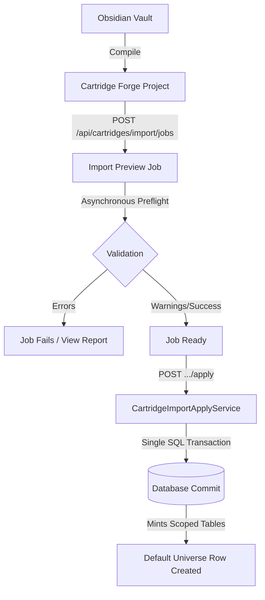

# Cartridge & Playthrough Runtime Architecture

Greenhaven enforces a strict separation between authored world data (**Cartridges**) and active hero state (**Playthroughs**). A player is represented as a portable hero who can step into different parallel worlds, carrying their core achievements while leaving world-local changes behind.

---

## 1. Core Architecture Concepts

| Concept | Scope | Database Representation | Mutability |
| :--- | :--- | :--- | :--- |
| **Cartridge** | Global static template | `cartridges`, `cartridge_records`, `entities` (static static rows) | Immutable after installation. Updated only via Reimport. |
| **Universe Instance**| Parallel world partition | `universe_instances` | Mutates only on schema/metadata upgrades. |
| **Playthrough** | Player $\times$ Cartridge state | `hero_cartridge_states`, `players` (coordinates), `player_quests`, `inventory_entries` | Highly mutable. Read-written on every game turn. |

---

## 2. Cartridge Import & Reimport Lifecycle

Cartridges compile from raw Obsidian Markdown vault directories using the `Cartridge Forge` compiler, producing machine-readable JSON manifolds. The import pipeline is fully transactional and asynchronous to prevent long-running filesystem operations from locking the HTTP event loop.



### Phase A: Preflight & Job Preview
1. **Directories Browser:** The client sweeps directories via `GET /api/filesystem/directories`. The server verifies folder structures and flags if they contain Obsidian vaults (`.obsidian`, `WORLD_MANIFEST.md`) or compiled Forge projects (`forge.project.json`).
2. **Preview Job Creation:** The operator calls `POST /api/cartridges/import/jobs`.
   - [CartridgeImportPreviewService](../../packages/web-server/src/services/CartridgeImportPreviewService.ts) initiates an asynchronous import preview job.
   - It reads the folder's assets and entity declarations, calculates a detailed diff summary (how many static locations, NPCs, quests, and dialogues will be added, modified, or deleted), and runs schema validators.
   - It returns a `jobId` and flips status to `processing`.
3. **Status Polling:** The client polls `GET /api/cartridges/import/jobs/:jobId` until the job reads `ready`. If validation failures occur, the exact schema lines and reasons are populated in the JSON payload.

### Phase B: Applying the Cartridge
Once a preview job is `ready`, the operator executes `POST /api/cartridges/import/jobs/:jobId/apply`.
- [CartridgeImportApplyService](../../packages/web-server/src/services/CartridgeImportApplyService.ts) opens a single database transaction.
- **Drift Gate Protection:** If the import is a reimport of an existing cartridge, the service validates `expectedCartridgeId` against the preview's metadata. If a mismatch is detected, the transaction aborts immediately (409 Conflict) before writing any records.
- **Dynamic Entity Mapping:** Authored entity records are written to `cartridge_records` and mapped to runtime `entities`.
- **Scoped Metadata Compilation:** Localized translations are compiled into structured translation tables, starting location slugs are resolved, and the cartridge-scoped visual assets manifest is committed.
- **Universe Provisioning:** The [UniverseInstanceService](../../packages/web-server/src/services/UniverseInstanceService.ts) is called to mint exactly one default `local_single_player` universe partition row in `universe_instances` for the new cartridge.
- **Completion:** The transaction is committed. Stale player-level sessions are flagged for cache clearing, and the status flips to `applied`.

---

## 3. Playthrough Launch & New-Game Contracts

Playthrough operations are managed by the [CartridgePlaythroughService](../../packages/web-server/src/services/CartridgePlaythroughService.ts).

### Playthrough Launch (`POST /playthroughs/launch`)
Used when a player selects a hero and cartridge pair to resume gameplay.
1. **Lookup & Verification:** The service checks if an existing `hero_cartridge_states` row exists for the `(player_id, cartridge_id)` pair with `status = 'active'`.
2. **Missing Playthrough Repair:** If no playthrough row is found, the server stops and rejects with `repair_required` (forcing the user interface to ask if they want to launch a fresh new-game).
3. **Activation & Cookie Refresh:** If found, the playthrough row's status is toggled to `active` (and other cartridges for the same hero are marked inactive). The player's auth cookie is refreshed to lock the session to this hero.
4. **Active Cartridge Decoupling (`FEAT-CART-LIB-7`):** Instead of relying on a legacy global `cartridge_meta.cartridge_id` cache, the turn runner and location services query `resolveActivePlayerCartridgeId(playerId)` to read directly from the player's active playthrough partition. This keeps overlapping worlds completely isolated.

### New-Game Playthrough (`POST /playthroughs/new-game`)
Used when launching a cartridge for the first time or deliberately resetting progress.
1. **Clean Slate State Purge:** Within a single transaction, the service wipes all previous playthrough entries for this specific `(player_id, cartridge_id)` pair:
   - Deletes player quest logs (`player_quests`).
   - Wipes player inventory entries (`inventory_entries`).
   - Deletes playthrough journal notices (`player_journal_entries`, `notices`).
   - Wipes playthrough memories (`npc_memories` owned by the hero).
   - Deletes save states (`save_slots`).
   - *Static cartridge records and other heroes' playthrough states are preserved completely.*
2. **Coordinates Anchor Resolution (`FEAT-ENGINE-BASELINE-6`):**
   - The service queries `starting_location_slug` from `cartridge_meta_scoped` and maps it to a valid location entity in the new cartridge.
   - If a reimport broke this link (e.g., spelling error), the launcher prevents boot (`no_starting_location` error), preventing players from spawning into empty space.
3. **Commit & Spawn:** Toggles the playthrough status in `hero_cartridge_states` to `active`, synchronizes the coordinate anchors inside `players.current_location_id`, and boots the session.

---

## 4. Hero Continuity & Parallel Universes

Greenhaven provides a robust, cross-world traveler ledger allowing players to move their characters from one installed cartridge to another while maintaining logical state consistency.

### Table Schema Structure
- **`universe_instances`**: Represents parallel partitions. The default is `local_single_player`.
- **`hero_continuity_events`**: Chronological ledger recording the travel history of the hero across universes.
- **`hero_portable_artifacts`**: Registry of ledger-tracked items carried between universes.
- **`hero_companion_bonds`**: Records emotional bonds, trust multipliers, and continuity anchors established with companions.
- **`hero_companion_capsules`**: Serialized snapshots of a companion's memories and profiles, frozen when exiting a source universe.
- **`companion_universe_projections`**: The runtime projections materialized from companion capsules when entering a target universe.

### State Taxonomy & Carryover Policy

When a hero prepares to hop to a new cartridge, [HeroContinuityService](../../packages/web-server/src/services/HeroContinuityService.ts) classifies all character data into three separate buckets based on the target world's `hero_continuity_policy`:

```text
               ┌──────────────────────────────┐
               │    Hero State Classification │
               └──────────────┬───────────────┘
                              │
         ┌────────────────────┼────────────────────┐
         ▼                    ▼                    ▼
   [ Hero Core ]      [ Universe Local ]    [ Ledger Travelers ]
   (Carries Over)     (Stays in Source)     (Ledger Synchronized)
   - Current XP       - Quest stage logs    - Companion bonds
   - Proficiency      - Local inventory     - Portable artifacts
   - Skill values     - Raw memories        - Memory capsules
   - Earned titles    - Social graph        - Unlocked recipes
```

#### 1. `hero_core` (Always Carried Over)
These represent intrinsic attributes belonging to the hero themselves. They carry over natively without modification:
- `players.current_xp` and `players.current_level`
- Skill scores and proficiencies (`player_skills`, `player_proficient_skills`, `player_stats`)
- Progression tracks and earned character titles (`player_titles`, `player_progression_tracks`)
- Player currency purses (`player_progression_wallets`).

#### 2. `universe_local` (Left Behind)
These represent attributes tied strictly to the topology, events, and populations of the source world. They are locked to the source universe's ID and never carry over:
- Location coordinates and visited flags (`players.current_location_id`, `visited_locations`).
- Inventory containers and items not explicitly marked portable.
- Quest progress logs (`player_quests`).
- Raw NPC memories and raw conversation logs.
- Local relationship intensity scores (to avoid spilling emotional state onto different NPCs in a new world).

#### 3. `Ledger Travelers` (Ledger Synchronized)
These are special items and companions that are licensed to cross parallel thresholds via explicit ledger entries.
- **Portable Artifacts:** Rare objects carrying the `portable` tag. When exiting, the item is deleted from the source inventory and written to `hero_portable_artifacts`. Upon entry, it materializes in the target inventory if the cartridge policy authorizes it.
- **Companions & Capsules:**
  - If a deep bond exists (`hero_companion_bonds`), exiting a universe freezes the companion's state into a `hero_companion_capsules` snapshot (summarizing memories, trust levels, and profile shifts).
  - When entering the target universe, the ledger spawns a `companion_universe_projections` entity, materializing the companion next to the hero with their memories and emotional bond intact.
