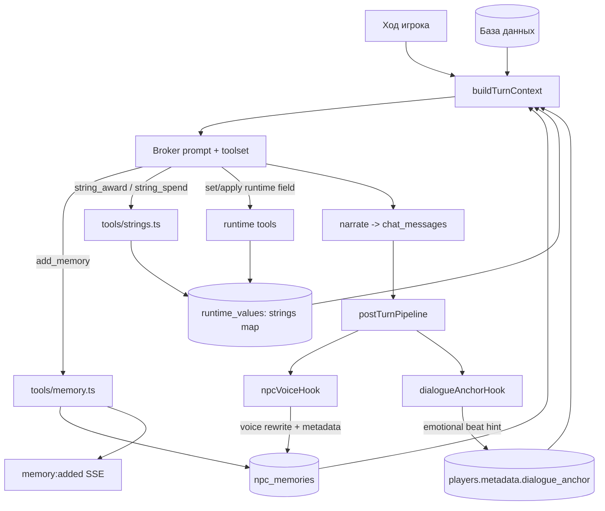
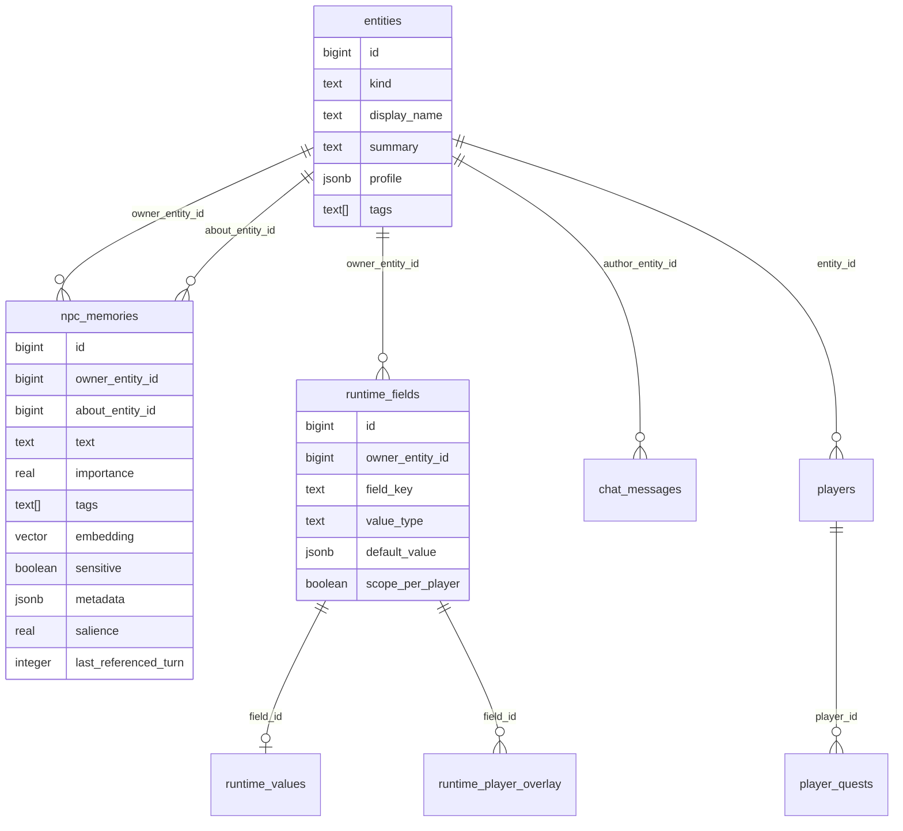
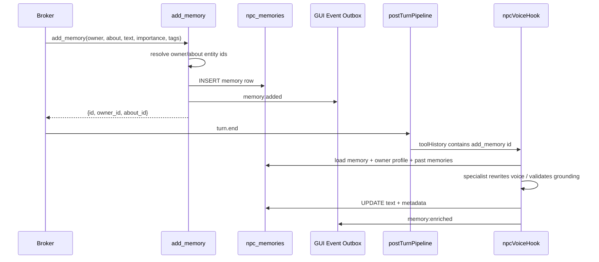
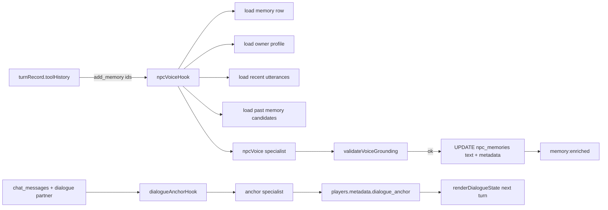

# Архитектура памяти NPC

Аудит выполнен: 2026-05-07.

Этот документ описывает, как в Greenhaven сейчас устроена память NPC: где она
хранится, кто ее пишет, кто читает, как она попадает в prompt-контекст, какие
агенты ее обогащают, и где уже видны технические расхождения. Важно: "память
NPC" в проекте - это не одна таблица, а несколько слоев состояния.

- `entities.profile` - статическая личность NPC: голос, персона, дом,
  агрессия, авторские связи, факты картриджа.
- `npc_memories` - долговременная эпизодическая память: что конкретный NPC
  помнит о игроке, другом NPC, месте или событии.
- `runtime_fields` / `runtime_values` / `runtime_player_overlay` - живое
  машинное состояние: mood, HP, флаги сцены, cooldown инициативы, состояние
  дверей, квестовые слоты.
- `strings` - эмоциональная память отношений между игроком и NPC.
- `chat_messages` - краткосрочная память диалога и сцены.
- `players.metadata.dialogue_anchor` - эмоциональная непрерывность текущего
  диалога после анализа Dialogue Anchor.

## Общая Схема



Главная сборка prompt-контекста начинается в
[`buildTurnContext`](../../packages/web-server/src/turnContext.ts#L248). Она
читает игрока, сцену, локацию, активные квесты, состояние диалога,
участников, runtime-поля и раскладывает это на static/dynamic блоки
([`turnContext.ts:274`](../../packages/web-server/src/turnContext.ts#L274),
[`turnContext.ts:355`](../../packages/web-server/src/turnContext.ts#L355)).

## Модель Хранения



### `entities`: Статическая Личность

Все объекты мира лежат в единой polymorphic-таблице `entities`
([`0001_cartridge.sql:25`](../../packages/web-server/migrations/0001_cartridge.sql#L25)).
NPC - это `kind='person'`. Для памяти важны:

- `display_name`: каноническое имя для tool-вызовов и стабильных `@` mentions.
- `summary`: короткое описание, которое попадает в контекст.
- `profile`: JSON с `speech_style`, `persona`, `home_id`, `aggression`,
  `initiative_cooldown_turns`, авторскими отношениями, исходными данными
  картриджа и другими фактами.
- `tags`: быстрые тематические маркеры.

`renderEntitySectionStatic` добавляет статическую карточку сущности в prompt
([`entitySections.ts:105`](../../packages/web-server/src/turnContext/entitySections.ts#L105)).
`profile` рендерится по ключам
([`entitySections.ts:184`](../../packages/web-server/src/turnContext/entitySections.ts#L184)).
Канонические имена намеренно не переводятся, чтобы `@` mentions и UI-matchers
оставались стабильными
([`entitySections.ts:25`](../../packages/web-server/src/turnContext/entitySections.ts#L25)).

### `npc_memories`: Долговременная Эпизодическая Память

Таблица долговременной памяти задана в
[`0001_cartridge.sql:160`](../../packages/web-server/migrations/0001_cartridge.sql#L160).
Одна строка - один факт, который кто-то помнит:

- `owner_entity_id`: кто помнит.
- `about_entity_id`: о ком/о чем память; обычно активный игрок, но может быть
  `NULL`.
- `text`: короткая first-person формулировка памяти.
- `importance`: 0..1, приоритет важности.
- `tags`: темы и связи.
- `embedding`: `vector(768)` для будущего ANN поиска
  ([`0001_cartridge.sql:168`](../../packages/web-server/migrations/0001_cartridge.sql#L168)).
- `sensitive`: флаг приватной/чувствительной памяти.
- `metadata`: `draft_text`, `voiced_by`, `internal_reflection`,
  `links_to_memory_id`, `link_reason`.
- `salience` и `last_referenced_turn`: ранжирование и отметка повторного
  обращения, добавлены в
  [`0035_memory_salience.sql:5`](../../packages/web-server/migrations/0035_memory_salience.sql#L5).

Важная текущая реальность: vector schema уже есть, но `query_memory` пока не
использует embeddings. Сейчас поиск работает через owner/about фильтры,
опциональный `ILIKE` и сортировку по importance/created_at
([`memory.ts:161`](../../packages/web-server/src/tools/memory.ts#L161),
[`memory.ts:179`](../../packages/web-server/src/tools/memory.ts#L179)).

### `runtime_fields`: Машинная Память Живого Состояния

`runtime_fields` объявлены в
[`0001_cartridge.sql:46`](../../packages/web-server/migrations/0001_cartridge.sql#L46).
Значения лежат в `runtime_values`, а per-player overlay добавлен в
[`0002_litrpg.sql:20`](../../packages/web-server/migrations/0002_litrpg.sql#L20).
Фактический порядок чтения реализован в `resolveFieldValue`: overlay, затем
global, затем default
([`runtimeContext.ts:69`](../../packages/web-server/src/tools/runtimeContext.ts#L69)).

`getEntityRuntimeContext` читает все runtime-поля сущности и активные
cartridge-инструкции
([`runtimeContext.ts:181`](../../packages/web-server/src/tools/runtimeContext.ts#L181)).
`renderEntityRuntime` печатает эти поля в dynamic prompt block
([`entitySections.ts:128`](../../packages/web-server/src/turnContext/entitySections.ts#L128),
[`entitySections.ts:194`](../../packages/web-server/src/turnContext/entitySections.ts#L194)).

Этот слой отвечает за то, что NPC "помнит" как состояние: настроение, HP,
последний инициативный ход, флаги сцены, открытые двери, последствия квестов.
Это не prose memory, но именно оно чаще всего меняет поведение агента.

### `strings`: Эмоциональная Память Отношений

`strings` - это эмоциональное влияние между игроком и NPC. Текущее хранение:
runtime field `strings` на NPC, значение - JSON map:

```json
{ "<player_entity_id>": 2 }
```

Код читает и пишет эту map через `runtime_values`
([`strings.ts:32`](../../packages/web-server/src/tools/strings.ts#L32),
[`strings.ts:46`](../../packages/web-server/src/tools/strings.ts#L46)).
Миграция `0027` добавляет поле всем `kind='person'`
([`0027_strings_field.sql:12`](../../packages/web-server/migrations/0027_strings_field.sql#L12)).

`string_award` меняет счетчик, эмитит runtime field change и `string:changed`
([`strings.ts:98`](../../packages/web-server/src/tools/strings.ts#L98),
[`strings.ts:107`](../../packages/web-server/src/tools/strings.ts#L107),
[`strings.ts:113`](../../packages/web-server/src/tools/strings.ts#L113)).
`string_spend` тратит счетчик и эмитит такой же event shape
([`strings.ts:161`](../../packages/web-server/src/tools/strings.ts#L161)).

Аудитное уточнение: старые docs местами называют strings per-player overlay.
Фактический код сейчас хранит global JSON map в `runtime_values`, где ключом
является `player_entity_id`.

### `chat_messages`: Краткосрочная Память Диалога

`chat_messages` создана в
[`0001_cartridge.sql:133`](../../packages/web-server/migrations/0001_cartridge.sql#L133).
Миграция `0007` добавляет `location_entity_id`, `npc_entity_id`, `player_id`
([`0007_dialogue_mode.sql:28`](../../packages/web-server/migrations/0007_dialogue_mode.sql#L28)).
Идея миграции: локации - broadcast channels, NPC - focused dialogue modes
([`0007_dialogue_mode.sql:3`](../../packages/web-server/migrations/0007_dialogue_mode.sql#L3)).

Prompt-facing история фильтруется через `playerScopedChatPredicate`, чтобы
чужой игрок не протекал в текущий prompt
([`chatHistoryScope.ts:21`](../../packages/web-server/src/chatHistoryScope.ts#L21)).
`renderDialogueState` читает недавний обмен и разворачивает его в порядок
oldest -> newest
([`dialogueContext.ts:172`](../../packages/web-server/src/turnContext/dialogueContext.ts#L172),
[`dialogueContext.ts:268`](../../packages/web-server/src/turnContext/dialogueContext.ts#L268)).

## Пути Записи



### Canonical Tool: `add_memory`

Главный путь записи - tool `add_memory`, зарегистрированный в
[`memory.ts:42`](../../packages/web-server/src/tools/memory.ts#L42). Его schema:

- `owner`: canonical display name или numeric entity id.
- `about`: display name/id или `null`.
- `text`: 1..2000 символов.
- `importance`: 0..1, default `0.5`.
- `tags`: массив строк.
- `sensitive`: boolean.

Execution:

1. Resolves owner/about ids
   ([`memory.ts:48`](../../packages/web-server/src/tools/memory.ts#L48)).
2. Считает `salience`
   ([`memory.ts:55`](../../packages/web-server/src/tools/memory.ts#L55)).
3. Делает `INSERT INTO npc_memories`
   ([`memory.ts:59`](../../packages/web-server/src/tools/memory.ts#L59)).
4. Эмитит `memory:added`
   ([`memory.ts:83`](../../packages/web-server/src/tools/memory.ts#L83)).
5. Возвращает `{id, owner_id, about_id}`
   ([`memory.ts:95`](../../packages/web-server/src/tools/memory.ts#L95)).

`resolveEntityId` принимает numeric id, numeric string, точный `display_name` и
legacy current-player token при наличии `playerId`
([`base.ts:684`](../../packages/web-server/src/tools/base.ts#L684)). Алиасы из
`profile.aliases` этот путь не резолвит, поэтому для памяти лучше использовать
numeric ids.

### Salience И Повторное Вспоминание

`add_memory` задает `salience = importance * 0.9 + 0.1`
([`memory.ts:55`](../../packages/web-server/src/tools/memory.ts#L55)).
`bump_memory_salience` отмечает, что память была использована в текущем ходе, и
поднимает salience, но с clamp до `importance`
([`memory.ts:106`](../../packages/web-server/src/tools/memory.ts#L106),
[`memory.ts:119`](../../packages/web-server/src/tools/memory.ts#L119)).

Аудитная проблема: при `importance < 1` начальная формула дает salience выше
importance. Следующий bump через `LEAST(importance, salience + bump)` может не
поднять, а снизить значение до importance. Это текущий код, и его стоит
исправлять отдельной задачей при настройке retrieval ranking.

### Prompt-Контракты На Запись Памяти

Broker получает правила из prompt fragments:

- Общий dialogue canon threshold описан в
  [`prompts/broker/memory.md:3`](../../packages/web-server/prompts/broker/memory.md#L3).
  Формат - одна короткая first-person память от имени активного NPC
  ([`memory.md:11`](../../packages/web-server/prompts/broker/memory.md#L11)).
- Combat memory обязательна после значимого обмена, убийства, бегства или
  сдачи
  ([`combat.md:97`](../../packages/web-server/prompts/broker/combat.md#L97)).
- State recap требует `query_memory` / `get_recent_history` только когда ответ
  зависит от прошлого
  ([`state-recap.md:6`](../../packages/web-server/prompts/broker/state-recap.md#L6)).
- Language fragment требует, чтобы `memory text` был в выбранном языке игрока
  ([`language.md:7`](../../packages/web-server/prompts/broker/language.md#L7)).

Broker prompt собирается в
[`ai/prompts.ts`](../../packages/web-server/src/ai/prompts.ts#L81). `memory.md`
подключен для dialogue и intimacy modes
([`prompts.ts:90`](../../packages/web-server/src/ai/prompts.ts#L90),
[`prompts.ts:100`](../../packages/web-server/src/ai/prompts.ts#L100)).

### Toolsets

Полный broker role включает `add_memory`, `bump_memory_salience`,
`query_memory`, `get_recent_history`, `evaluate_social_standing`,
`summarize_relationships`
([`toolsets.ts:34`](../../packages/web-server/src/ai/toolsets.ts#L34)).
Narrow profiles оставляют только нужный набор:

- `quest_seed` может создать память и квест
  ([`toolsets.ts:128`](../../packages/web-server/src/ai/toolsets.ts#L128)).
- `quest_detail` может читать memory/history, но не пишет memory
  ([`toolsets.ts:138`](../../packages/web-server/src/ai/toolsets.ts#L138)).
- `adventure_accept` может писать память и стартовать/двигать квест
  ([`toolsets.ts:149`](../../packages/web-server/src/ai/toolsets.ts#L149)).
- `state_recap` может читать и писать память, если разбор состояния создает
  новый canon
  ([`toolsets.ts:178`](../../packages/web-server/src/ai/toolsets.ts#L178)).

### Quest Reward Memory

`applyQuestRewards` может напрямую вставлять reward-memory в `npc_memories`
([`quest.ts:943`](../../packages/web-server/src/tools/quest.ts#L943),
[`quest.ts:984`](../../packages/web-server/src/tools/quest.ts#L984)).
Он предпочитает numeric `owner_entity_id` / `about_entity_id`, потом string refs,
и если owner отсутствует - использует активного игрока
([`quest.ts:986`](../../packages/web-server/src/tools/quest.ts#L986)).

Аудитная проблема: этот путь делает direct SQL insert, а не `add_memory`.
Следствия:

- нет `memory:added`;
- salience не seed-ится через формулу `add_memory`;
- `npcVoiceHook` не увидит эту память, потому что он сканирует `toolHistory` по
  результатам `add_memory`;
- память reward может остаться без voice rewrite и без SSE-карточки.

### Combat И Intimacy

Combat Director передает broker'у `memory_canon` и прямо говорит вызвать
`add_memory` после применения damage
([`combatDirectorBriefing.ts:18`](../../packages/web-server/src/agents/combatDirectorBriefing.ts#L18),
[`combatDirectorBriefing.ts:35`](../../packages/web-server/src/agents/combatDirectorBriefing.ts#L35)).

Intimacy empty-output fallback тоже пишет память, если модель вернула пустой
ответ. Успешный consensual beat пишет sensitive память
([`turnBrokerStage.ts:451`](../../packages/web-server/src/turnBrokerStage.ts#L451)),
boundary beat пишет boundary memory
([`turnBrokerStage.ts:469`](../../packages/web-server/src/turnBrokerStage.ts#L469)).

Finalization guards блокируют canon writes, включая memory, если до этого в том
же ходе неразрешенно упал payment/world-state tool
([`finalizationGuards.ts:20`](../../packages/web-server/src/agents/finalizationGuards.ts#L20),
[`finalizationGuards.ts:236`](../../packages/web-server/src/agents/finalizationGuards.ts#L236),
[`finalizationGuards.ts:294`](../../packages/web-server/src/agents/finalizationGuards.ts#L294)).

## Пути Чтения

### Dialogue Preamble

Если у игрока есть focused dialogue partner, `renderDialogueState` берет top-3
памяти, где `owner_entity_id = npcId` и `about_entity_id = playerId`
([`dialogueContext.ts:236`](../../packages/web-server/src/turnContext/dialogueContext.ts#L236)).
SQL сортирует по `salience DESC LIMIT 3`
([`dialogueContext.ts:246`](../../packages/web-server/src/turnContext/dialogueContext.ts#L246)).

В prompt это попадает так:

```text
### What this NPC remembers about the active player (top 3 by salience):
- (sal 0.73) <memory text>
```

Сейчас туда попадает только `text`. `metadata.internal_reflection` и
`metadata.links_to_memory_id` сохраняются, но обратно в broker preamble не
инжектятся.

### Dialogue Participants

`renderDialogueParticipants` читает `mood`, `stance`, `strings` для присутствующих
NPC
([`dialogueContext.ts:60`](../../packages/web-server/src/turnContext/dialogueContext.ts#L60)).
Затем считает string count/band для активного игрока
([`dialogueContext.ts:87`](../../packages/web-server/src/turnContext/dialogueContext.ts#L87))
и печатает компактную строку участника
([`dialogueContext.ts:123`](../../packages/web-server/src/turnContext/dialogueContext.ts#L123)).

### Read-Only Tools

`query_memory` читает memory bank конкретного owner, с опциональными фильтрами
по subject, text query, min importance и limit
([`memory.ts:133`](../../packages/web-server/src/tools/memory.ts#L133),
[`memory.ts:144`](../../packages/web-server/src/tools/memory.ts#L144)).
Сейчас сортировка идет по `importance DESC, created_at DESC`
([`memory.ts:179`](../../packages/web-server/src/tools/memory.ts#L179)).

`summarize_relationships` объединяет strings, memories, recent dialogue и tool
events
([`worldSensing.ts:35`](../../packages/web-server/src/tools/worldSensing.ts#L35),
[`worldSensing.ts:45`](../../packages/web-server/src/tools/worldSensing.ts#L45)).
Память отношений читается в обе стороны: target remembers player или player
remembers target
([`worldSensing.ts:216`](../../packages/web-server/src/tools/worldSensing.ts#L216)).

`get_recent_history` может включать memories about player
([`worldSensing.ts:137`](../../packages/web-server/src/tools/worldSensing.ts#L137),
[`worldSensing.ts:155`](../../packages/web-server/src/tools/worldSensing.ts#L155)).
Loader берет все memory rows, где `about_entity_id = playerId`
([`worldSensing.ts:337`](../../packages/web-server/src/tools/worldSensing.ts#L337)).

### Adventure Materializer

Random/adventure materializer получает memory и relationship evidence перед
созданием hook'а. `buildMaterializerInput` собирает nearby, relationships,
relevant memories, active situations и recent narrative
([`adventureMaterializerInput.ts:53`](../../packages/web-server/src/agents/adventureMaterializerInput.ts#L53)).

`loadRelationships` читает nearby persons' `strings`
([`adventureMaterializerInput.ts:291`](../../packages/web-server/src/agents/adventureMaterializerInput.ts#L291)).
`loadRelevantMemories` берет memories, где owner или subject входит в relevant
entity set, сортируя по importance и id
([`adventureMaterializerInput.ts:326`](../../packages/web-server/src/agents/adventureMaterializerInput.ts#L326)).
Prompt разрешает использовать relationships/memories только как causal support,
но не как разрешение выдумывать ownership/access/knowledge
([`adventureMaterializerPrompt.ts:36`](../../packages/web-server/src/agents/adventureMaterializerPrompt.ts#L36),
[`adventureMaterializerPrompt.ts:48`](../../packages/web-server/src/agents/adventureMaterializerPrompt.ts#L48)).

### NPC Agency Evaluator

`evaluateNpcAgency` - post-turn система, которая дает NPC инициативу
([`npcAgencyEvaluator.ts:7`](../../packages/web-server/src/agency/npcAgencyEvaluator.ts#L7)).
Она оценивает NPC в текущей локации игрока по HP, mood, strings, threat
surfaces, aggression, cooldown и небольшому random kicker
([`npcAgencyEvaluator.ts:81`](../../packages/web-server/src/agency/npcAgencyEvaluator.ts#L81),
[`npcAgencyEvaluator.ts:179`](../../packages/web-server/src/agency/npcAgencyEvaluator.ts#L179)).

Граница ответственности: evaluator сейчас не читает `npc_memories` напрямую.
Он читает strings
([`npcAgencyEvaluator.ts:292`](../../packages/web-server/src/agency/npcAgencyEvaluator.ts#L292))
и runtime signals. Prose memory влияет на инициативу только косвенно: через
следующий broker prompt, runtime changes или authored state.

## Post-Turn Агенты Памяти



### Per-NPC Voice Engine

`npcVoiceHook` подключен в post-turn pipeline
([`postTurnPipeline.ts:37`](../../packages/web-server/src/postTurnPipeline.ts#L37)).
Он сканирует `turnRecord.toolHistory` и собирает ids успешных `add_memory`
([`npcVoice.ts:59`](../../packages/web-server/src/agents/npcVoice.ts#L59)).
Каждая memory обрабатывается отдельно через `Promise.allSettled`
([`npcVoice.ts:69`](../../packages/web-server/src/agents/npcVoice.ts#L69)).

`enrichOneMemory` делает:

1. Загружает row из `npc_memories`
   ([`npcVoice.ts:304`](../../packages/web-server/src/agents/npcVoice.ts#L304)).
2. Пропускает уже voiced memory по `metadata.voiced_by`
   ([`npcVoice.ts:151`](../../packages/web-server/src/agents/npcVoice.ts#L151)).
3. Загружает owner entity profile
   ([`npcVoice.ts:156`](../../packages/web-server/src/agents/npcVoice.ts#L156)).
4. Пропускает player-owned memories
   ([`npcVoice.ts:159`](../../packages/web-server/src/agents/npcVoice.ts#L159)).
5. Требует хотя бы `profile.speech_style` или `profile.persona`
   ([`npcVoice.ts:165`](../../packages/web-server/src/agents/npcVoice.ts#L165)).
6. Загружает recent utterances из `chat_messages`
   ([`npcVoice.ts:330`](../../packages/web-server/src/agents/npcVoice.ts#L330)).
7. Загружает past memory candidates по same subject, tag overlap, importance
   ([`npcVoice.ts:355`](../../packages/web-server/src/agents/npcVoice.ts#L355)).
8. Запускает specialist и проверяет grounding
   ([`npcVoice.ts:191`](../../packages/web-server/src/agents/npcVoice.ts#L191),
   [`npcVoice.ts:246`](../../packages/web-server/src/agents/npcVoice.ts#L246)).
9. Обновляет `npc_memories.text` и metadata
   ([`npcVoice.ts:405`](../../packages/web-server/src/agents/npcVoice.ts#L405),
   [`npcVoice.ts:420`](../../packages/web-server/src/agents/npcVoice.ts#L420)).
10. Эмитит `memory:enriched`
    ([`npcVoice.ts:428`](../../packages/web-server/src/agents/npcVoice.ts#L428)).

Prompt требует same meaning, first-person voice, selected language, no invented
facts, strict length caps и только genuine cross-reference
([`npcVoicePrompt.ts:45`](../../packages/web-server/src/agents/npcVoicePrompt.ts#L45),
[`npcVoicePrompt.ts:63`](../../packages/web-server/src/agents/npcVoicePrompt.ts#L63)).

### Dialogue Anchor

`dialogueAnchorHook` работает после хода, если был `narrate` и у игрока есть
`dialogue_partner_id`
([`dialogueAnchor.ts:67`](../../packages/web-server/src/agents/dialogueAnchor.ts#L67)).
Он читает partner profile, последние 5 exchanges, предыдущий emotional beat и
language
([`dialogueAnchor.ts:74`](../../packages/web-server/src/agents/dialogueAnchor.ts#L74),
[`dialogueAnchor.ts:89`](../../packages/web-server/src/agents/dialogueAnchor.ts#L89)).

Specialist возвращает:

- `emotional_beat`
- `beat_reason`
- `voice_drift_score`
- `voice_drift_examples`
- `memory_threshold_crossed`
- `memory_threshold_reason`

Prompt считает memory threshold настоящим только для канонических сдвигов:
фракция, биография, confession/commitment, model-shift, первый relationship beat
([`dialogueAnchorPrompt.ts:49`](../../packages/web-server/src/agents/dialogueAnchorPrompt.ts#L49)).
Результат сохраняется в
`players.metadata.dialogue_anchor[<partner_id>]`
([`dialogueAnchor.ts:279`](../../packages/web-server/src/agents/dialogueAnchor.ts#L279)).
Следующий `renderDialogueState` показывает этот hint в prompt
([`dialogueContext.ts:195`](../../packages/web-server/src/turnContext/dialogueContext.ts#L195)).

Это не автоматическая запись в `npc_memories`. Если Anchor поставил
`memory_threshold_crossed: TRUE`, следующий broker должен вызвать `add_memory`.

## Save/Restore

Save slots snapshot'ят memories, где `about_entity_id = player`
([`routes/saves.ts:73`](../../packages/web-server/src/routes/saves.ts#L73)).
При restore текущие subject memories игрока сначала удаляются
([`routes/saves.ts:128`](../../packages/web-server/src/routes/saves.ts#L128)).

Аудитная проблема: restore insert до сих пор использует старые имена колонок
`npc_entity_id` и `summary`
([`routes/saves.ts:150`](../../packages/web-server/src/routes/saves.ts#L150)).
Актуальная schema использует `owner_entity_id` и `text`. До фикса save/restore
NPC memories нельзя считать надежным.

## Player-Facing Журнал И Приватность (FEAT-MEMORY-1)

`npc_memories` — это внутренняя память NPC. Игрок не должен читать ни
сырой `text`, ни `summary`, ни `metadata.draft_text`,
`metadata.internal_reflection`, `metadata.link_reason`, ни `tags`, ни
`kind`/`category`. В чате это уже соблюдает
`packages/web-ui/src/components/chat/EventCardMemory.tsx` (рендерит
безличное «X noticed something» / «X recalled something»).

Та же приватность распространяется на durable Notice Journal:

- `gui_events` остаётся неизменным audit/outbox источником правды —
  его не чистим.
- Проекция в `player_journal_entries` и ответ
  `/api/player/:id/notices` идут через
  `sanitizeJournalPayload(eventType, payload)` из
  [`NoticeJournalService.ts`](../../packages/web-server/src/services/NoticeJournalService.ts).
  Для `memory:added` / `memory:enriched` whitelist держит только
  `memoryId`, `ownerId`, `ownerName`, `aboutId`, `aboutName` и
  `importance`. Всё остальное (включая `text`, `summary`, `tags`,
  `kind`, `category`, `sensitive`, `internal_reflection`,
  `link_reason`, `draft_text`, `links_to_memory_id`) выбрасывается.
- `title` для memory всегда детерминированный generic placeholder
  (`"Memory recorded"` / `"Memory deepened"`), `body` — `null`.
  UI локализует через стандартные `event_type` ключи.
- Sanitizer применяется **и на INSERT** (новые строки не попадают на
  диск с сырой памятью), **и на read** (legacy-строки чистятся в
  `list()` перед отдачей; sanitizer идемпотентен). На read-пути
  `list()` дополнительно прогоняет `title` через `deriveTitle()`,
  поэтому даже если в `player_journal_entries.title` уже лежит
  pre-FEAT-MEMORY-1 значение `kind`/`category` (например
  `"betrayal"`, `"intimacy"`), API/UI всё равно вернут generic
  `"Memory recorded"` / `"Memory deepened"`. Диск read-путь
  **не мутирует** — это intentional read-only sanitization без
  миграции.

Подробности контракта — [`docs/web-ui/notice-journal.md`](../web-ui/notice-journal.md)
секция «Memory privacy (FEAT-MEMORY-1)».

Стабильный smoke для проверки контракта (оба пути — материализация
и legacy-title — в одном прогоне на изолированном temp PGlite):

```sh
npm --prefix packages/web-server run live:notice-journal-privacy
```

Скрипт лежит в
`packages/web-server/src/scripts/notice-journal-memory-privacy-smoke.ts`
и пишет `summary.json` / `result.json` + per-step SQL/HTTP-снапшоты в
`.codex/run-logs/live-playtest/notice-journal-memory-privacy-smoke/`
(или в `--out <dir>`). Полезно прогнать после любого изменения в
`NoticeJournalService.ts`, `sanitizeJournalPayload`, или новых
read-paths, экспонирующих journal-shape данные.

Практическое следствие для backend-изменений: если в будущем
появится другой player-facing surface, экспонирующий journal-shape
данные, прогоняй payload через тот же `sanitizeJournalPayload`,
чтобы не открыть второй канал утечки.

## Диагностические SQL-Запросы

Найти NPC:

```sql
SELECT id, kind, display_name, summary, profile
FROM entities
WHERE display_name = 'Mikka Quickgrin';
```

Что NPC помнит о конкретном игроке:

```sql
SELECT m.id, m.text, m.importance, m.salience, m.tags,
       m.sensitive, m.metadata, m.created_at
FROM npc_memories m
WHERE m.owner_entity_id = :npc_id
  AND m.about_entity_id = :player_id
ORDER BY m.salience DESC, m.importance DESC, m.created_at DESC;
```

Все memories о игроке по владельцам:

```sql
SELECT m.id, owner.display_name AS owner, m.text,
       m.importance, m.salience, m.tags, m.metadata
FROM npc_memories m
JOIN entities owner ON owner.id = m.owner_entity_id
WHERE m.about_entity_id = :player_id
ORDER BY owner.display_name, m.importance DESC, m.created_at DESC;
```

Strings NPC к игроку:

```sql
SELECT e.id, e.display_name,
       COALESCE(rv.value, rf.default_value) ->> :player_id_text AS strings_to_player,
       COALESCE(rv.value, rf.default_value) AS full_strings_map
FROM entities e
JOIN runtime_fields rf ON rf.owner_entity_id = e.id
LEFT JOIN runtime_values rv ON rv.field_id = rf.id
WHERE e.kind = 'person'
  AND rf.field_key = 'strings'
ORDER BY e.display_name;
```

Dialogue Anchor по игроку:

```sql
SELECT metadata->'dialogue_anchor' AS dialogue_anchor
FROM players
WHERE entity_id = :player_id;
```

Memory writes в конкретном turn:

```sql
SELECT id, tool_name, args, result, error, invoked_at
FROM tool_invocations
WHERE session_id = :session_id
  AND turn_id = :turn_id
  AND tool_name IN ('add_memory','bump_memory_salience','string_award','string_spend')
ORDER BY invoked_at;
```

## Текущие Риски И Несостыковки

1. Vector search не включен. `embedding` и HNSW index есть, но `query_memory`
   использует SQL filters и `ILIKE`.
2. `npcVoiceHook` обогащает только memories, созданные через `add_memory`.
   Direct SQL inserts, например quest rewards, не voiced и не дают
   `memory:added`.
3. Dialogue preamble читает только `npc_memories.text`; `internal_reflection` и
   cross-links хранятся, но не возвращаются в prompt.
4. NPC Agency Evaluator не читает prose memories напрямую. Он читает HP, mood,
   strings, surfaces, aggression, cooldown.
5. `strings` сейчас global JSON map в `runtime_values`, а не
   `runtime_player_overlay`, несмотря на старые описания.
6. Save restore для NPC memories использует устаревшие колонки и должен быть
   исправлен.
7. `resolveEntityId` для `add_memory` не резолвит `profile.aliases`; лучше
   передавать numeric ids.
8. Salience seed и bump противоречат друг другу при `importance < 1`.

## Практические Правила Для Backend-Изменений

- Для runtime-памяти используй `add_memory`, если нет явной причины обходить
  SSE, salience seed, tool audit и NPC Voice enrichment.
- Если quest reward должен писать memory, он должен либо идти через tool, либо
  вручную повторять side effects: salience, `memory:added`, eligibility для
  voice enrichment.
- Память должна быть короткой, first-person, на выбранном языке игрока.
- Эмоциональную близость/влияние пиши в `strings`, а не только в prose memory.
- Машинно-важные факты пиши в runtime fields, а не только в prose memory.
- Если новый prompt path создает durable canon, проверь, что его toolset имеет
  `add_memory` или явно объясняет, почему память там запрещена.
- При баге "NPC забыл" проверяй все слои: `npc_memories`, `strings`,
  runtime fields, `chat_messages`, `players.metadata.dialogue_anchor` и
  `tool_invocations`.
